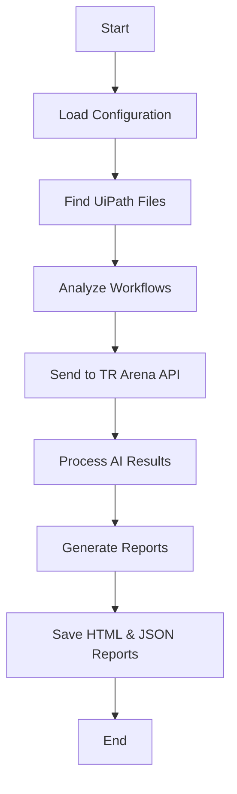

# AI Review Tool Documentation

## Table of Contents
1. [Overview](#overview)
2. [Architecture](#architecture)
3. [Components](#components)
4. [Flow Diagram](#flow-diagram)
5. [Code Structure](#code-structure)
6. [Analysis Process](#analysis-process)
7. [Reports](#reports)

## Overview

The AI Review Tool is designed to analyze UiPath workflows and provide intelligent suggestions for improvements. It combines static code analysis with AI-powered recommendations to help maintain high-quality automation projects.

## Architecture

### Directory Structure
```
src/
├── main.py              # Entry point
├── config/
│   └── settings.yaml    # Configuration
├── ai/
│   ├── code_analyzer.py      # AI integration
│   └── report_generator.py   # Report generation
└── api/
    └── workflow_analyzer.py  # Static analysis
```

### Key Components

1. **Main Entry Point** (`main.py`)
   - Initializes the analysis process
   - Loads configuration
   - Orchestrates the workflow

2. **Static Analyzer** (`workflow_analyzer.py`)
   - Performs static code analysis
   - Checks for common issues
   - Validates against best practices

3. **AI Analyzer** (`code_analyzer.py`)
   - Connects with TR Arena API
   - Processes analysis results
   - Generates AI-enhanced suggestions

4. **Report Generator** (`report_generator.py`)
   - Creates HTML reports
   - Generates JSON summaries
   - Formats results for readability

## Flow Diagram



## Code Structure

### Main Process Flow

```python
def analyze_repository(repo_path: str):
    # 1. Load configuration
    config_path = os.path.join(repo_path, 'src', 'config', 'settings.txt')
    
    # 2. Find UiPath files
    uipath_files = find_uipath_files(repo_path)
    
    # 3. Initialize analyzers
    analyzer = AICodeAnalyzer(ai_endpoint, api_key)
    
    # 4. Generate reports
    report_generator = ReportGenerator()
```

### Static Analysis Rules

1. **Exception Handling (UI-DBP-006)**
   - Checks for proper try-catch blocks
   - Validates error handling

2. **Logging (UI-DBP-013)**
   - Ensures adequate logging
   - Validates log message placement

3. **Comments (UI-DBP-007)**
   - Checks for code documentation
   - Validates comment quality

4. **Hardcoded Values (UI-DBP-008)**
   - Identifies hardcoded strings
   - Suggests configuration usage

5. **Naming Convention (ST-NMG-001)**
   - Validates variable names
   - Checks activity naming

6. **Unused Variables (ST-USG-002)**
   - Identifies unused declarations
   - Suggests cleanup

## Analysis Process

### 1. Input Processing
- Reads UiPath project files (.xaml)
- Loads configuration settings
- Validates TR Arena API credentials

### 2. Static Analysis
- Scans workflow files
- Identifies rule violations
- Generates initial report

### 3. AI Enhancement
- Connects to TR Arena API
- Processes violations
- Generates intelligent suggestions

### 4. Report Generation
- Creates detailed HTML report
- Generates JSON summary
- Includes metrics and recommendations

## Reports

### HTML Report Sections

1. **Project Overview**
   - Basic project information
   - Analysis timestamp
   - Overall quality score

2. **Quality Metrics**
   - Maintainability (0-100)
   - Reliability (0-100)
   - Performance (0-100)
   - Security (0-100)

3. **Rule Violations**
   - Severity level
   - File location
   - Detailed description
   - Recommended fix

4. **TR AI Suggestions**
   - AI-powered recommendations
   - Best practices
   - Implementation guidance

5. **Next Steps**
   - Prioritized actions
   - Improvement roadmap
   - Critical fixes

### JSON Report Structure

```json
{
  "decision": "NO_GO",
  "quality_score": 75,
  "total_violations": 122,
  "critical_issues": 71,
  "recommendations": [],
  "violations": [
    {
      "RuleId": "UI-DBP-006",
      "RuleName": "Missing Exception Handling",
      "Severity": "Error",
      "Description": "Pattern 'TryCatch' found in workflow.",
      "Recommendation": "Add TryCatch blocks for proper exception handling.",
      "File": "Main.xaml"
    }
  ]
}
```

## Configuration

### settings.yaml
```yaml
ai_arena:
  api_key: <your_api_key>
  endpoint: <api_endpoint>
  model_name: openai_gpt-4-turbo
```

### Quality Thresholds
- Error Threshold: 5 violations
- Warning Threshold: 10 violations
- Quality Score Minimum: 80

## Usage

1. **Setup**
   ```powershell
   # Clone repository
   git clone https://github.com/TRAutomationTeam/Test-AI-Review.git
   cd Test-AI-Review
   
   # Configure settings
   notepad src/config/settings.yaml
   ```

2. **Run Analysis**
   ```powershell
   python src/main.py
   ```

3. **View Reports**
   - Open generated HTML report
   - Review JSON summary
   - Implement suggestions

## Conclusion

The AI Review Tool provides comprehensive analysis of UiPath workflows by combining:
- Static code analysis
- AI-powered recommendations
- Detailed reporting
- Actionable suggestions

This helps maintain high-quality automation projects by identifying issues early and providing clear guidance for improvements.
